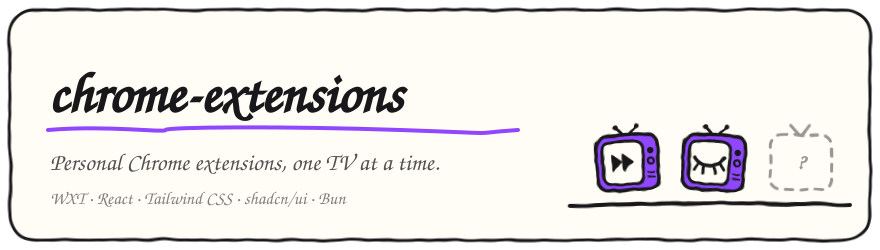
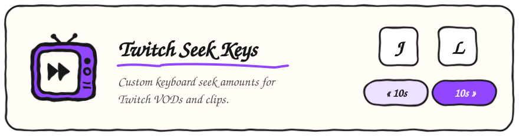
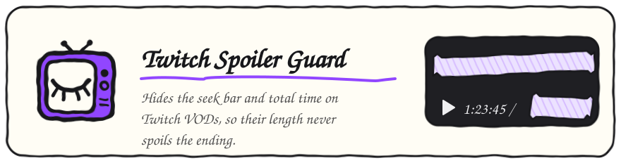

<p align="center">
  
</p>

Personal Chrome extensions, built with [WXT](https://wxt.dev), React, Tailwind CSS, and shadcn/ui on Bun workspaces.

## Extensions

<!-- extensions:start -->

<a href="extensions/twitch-seek-keys"></a>

<a href="extensions/twitch-spoiler-guard"></a>

<!-- extensions:end -->

## Development

```sh
bun install
bun dev <name>  # Open Chrome with one extension, reloading on change
bun run zip     # Package every extension into extensions/<name>/.output
bun run readme  # Redraw the cards above after adding or changing an extension
```
